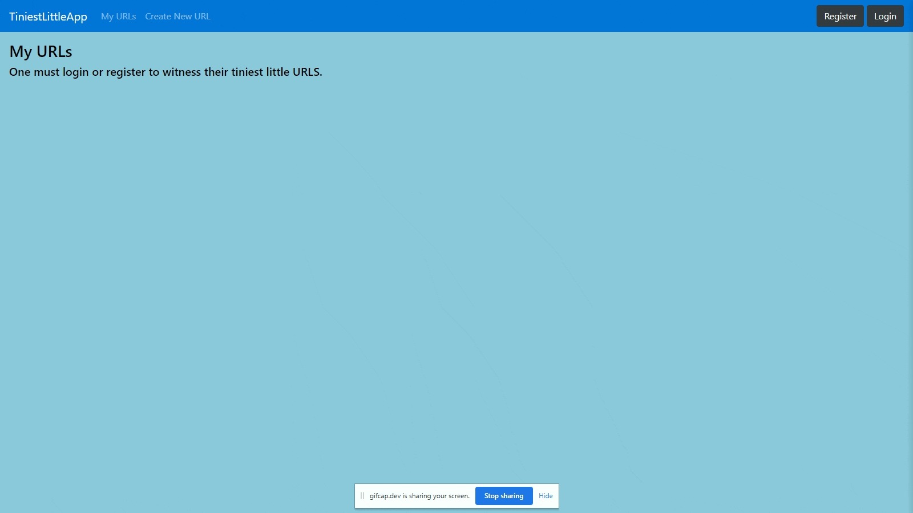

# TiniestLittleApp Project

TiniestLittleApp is a multipage app that creates miniaturized urls. It is the first project made during the Lighthouse Labs Web Development Bootcamp. It is a project that allows one to register, login, and create, delete, and edit the urls that were created. It was created in order to practice using EJS, JS, Express, and NodeJS. It was difficult to comprehend the dynamics of the project initially because of the lack of familiarity with the concepts and implementation steps. 

## Final Product

## Getting Started

- `Git clone` this project and `cd` into the directory
- Install all dependencies using the `npm install` command
- Run the development web server using the `node express_server.js` command
